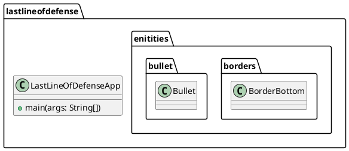

```plantuml
@startuml
package "lastlineofdefense" {
  class "LastLineOfDefenseApp" {
    + main(args: String[])
  }
  package "enitities" {
    package "borders" {
        class "BorderBottom" {
        }
    }
    package "bullet" {
        class "Bullet" {
            
        }
    }
  }
}
@enduml
```