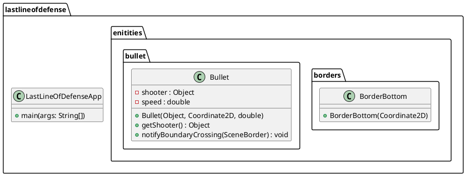

```plantuml
@startuml
package "lastlineofdefense" {
  class "LastLineOfDefenseApp" {
    + main(args: String[])
  }
  package "enitities" {
    package "borders" {
        class "BorderBottom" {
            + BorderBottom(Coordinate2D)
        }
    }
    package "bullet" {
        class "Bullet" {
            - shooter : Object
            - speed : double
            
            + Bullet(Object, Coordinate2D, double)
            + getShooter() : Object
            + notifyBoundaryCrossing(SceneBorder) : void
        }
    }
  }
}
@enduml
```