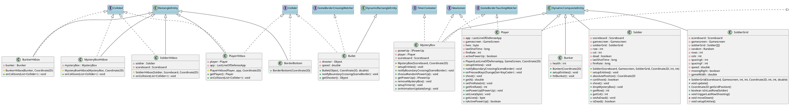

```plantuml
@startuml
class BorderBottom {
    + BorderBottom(Coordinate2D)
}
class Bullet {
    - shooter : Object
    - speed : double
    
    + Bullet(Object, Coordinate2D, double)
    + notifyBoundaryCrossing(SceneBorder) : void
    + getShooter() : Object
}
class Bunker {
    - health : int
    
    + Bunker(Coordinate2D)
    + setupEntities() : void
    + hitBunker() : void
}
class BunkerHitbox {
    - bunker : Bunker
    
    # BunkerHitbox(Bunker, Coordinate2D)
    + onCollision(List<Collider>) : void
}
class BunkerSprite {
    # BunkerSprite(Coordinate2D)
}
class PlayButton {
    - app : LastLineOfDefenseApp
    
    + PlayButton(LastLineOfDefenseApp, Coordinate2D, String)
    + onMouseButtonPressed(MouseButton, Coordinate2D) : void
    + onMouseEntered() : void
    + onMouseExited() : void
}
class QuitButton {
    - app : LastLineOfDefenseApp
    
    + QuitButton(LastLineOfDefenseApp, Coordinate2D, String)
    + onMouseButtonPressed(MouseButton, Coordinate2D) : void
    + onMouseEntered() : void
    + onMouseExited() : void
}
class MysteryBox {
    - powerUp : IPowerUp
    - player : Player
    - scoreboard : Scoreboard
    
    + MysteryBox(Scoreboard, Coordinate2D)
    # setupEntities() : void
    + notifyBoundaryCrossing(SceneBorder) : void
    + chooseRandomPowerUp() : void
    + getPowerUp() : IPowerUp
    + removeMysteryBox() : void
    + setupTimers() : void
    + onAnimationUpdate(long) : void
}
class MysteryBoxHitbox {
    - mysteryBox : MysteryBox
    
    # MysteryBoxHitbox(MysteryBox, Coordinate2D)
    + onCollision(List<Collider>) : void
}
class MysteryBoxSprite {
    # MysteryBoxSprite(Coordinate2D)
}
class Player {
    - app : LastLineOfDefenseApp
    - gamescreen : GameScreen
    - lives : byte
    - lastShotTime : long
    - fireRate : int
    - activePowerUp : boolean
    
    + Player(LastLineOfDefenseApp, GameScreen, Coordinate2D)
    # setupEntities() : void
    + notifyBoundaryCrossing(SceneBorder) : void
    + onPressedKeysChange(Set<KeyCode>) : void
    + shoot() : void
    + getX() : double
    + setFireRate(int) : void
    + getFireRate() : int
    + setPowerUp(IPowerUp) : void
    + setLives(byte) : void
    + getLives() : byte
    + isActivePowerUp() : boolean
}
class PlayerHitbox {
    - player : Player
    - app : LastLineOfDefenseApp
    
    # PlayerHitbox(Player, app, Coordinate2D)
    + getPlayer() : Player
    + onCollision(List<Collider>) : void
}
class PlayerSprite {
    # PlayerSprite(Coordinate2D)
}
class DoublePoints {
    - scoreboard : Scoreboard
    
    + DoublePoints(Scoreboard)
    + activatePowerUp(Player) : void
    + deactivatePowerUp(Player) : void
}
class DoubleTap {
    + DoubleTap(LastLineOfDefenseApp, Player)
    + activatePowerUp(Player) : void
    + deactivatePowerUp(Player) : void
}
class FullAuto {
    - originalFireRate : int
    + activatePowerUp(Player) : void
    + deactivatePowerUp(Player) : void
}
class PlusOneLife {
    + activatePowerUp(Player) : void
    + deactivatePowerUp(Player) : void
}
interface IPowerUp {
    activatePowerUp(Player) : void
    deactivatePowerUp(Player) : void
}
class Soldier {
    - scoreboard : Scoreboard
    - gamescreen : Gamescreen
    - soldierGrid : SoldierGrid
    - row : int
    - col : int
    - dead : boolean
    - lastShotTime : long
    - fireRate : long
    
    + Soldier(Scoreboard, Gamescreen, SoldierGrid, Coordinate2D, int, int)
    # setupEntities() : void
    + absolutePosition() : Coordinate2D
    + canShoot() : boolean
    + shoot() : void
    + dropMysteryBox() : void
    + getRow() : int
    + getCol() : int
    + setAsDead() : void
    + isDead() : boolean
}
class SoldierGrid {
    - scoreboard : Scoreboard
    - gamescreen : Gamescreen
    - soldierGrid : Soldier[][]
    - random : Random
    - rows : int
    - cols : int
    - spacingX : int
    - spacingY : int
    - speed : double
    - movingRight : boolean
    - gameWidth : double
    
    + SoldierGrid(Scoreboard, Gamescreen, int, int, Coordinate2D, int, int, double)
    + void update()
    + Coordinate2D getGridPosition()
    + boolean isInLastRow(Soldier)
    + void triggerLastRowShooting()
    - void moveDown()
    # void setupEntities()
}
class SoldierHitbox {
    - soldier : Soldier
    - scoreboard : Scoreboard
    
    # SoldierHitbox(Soldier, Scoreboard, Coordinate2D)
    + onCollision(List<Collider>) : void
}
class SoldierSprite {
    # SoldierSprite(Coordinate2D)
}
class Lives {
    + Lives(Coordinate2D)
}
class Scoreboard {
- currentScore : int
- highScore : int
- doublePoints : boolean

+ Scoreboard(Coordinate2D)
+ displayScore() : void
+ displayHighScore() : void
+ getCurrentScore() : int
+ setCurrentScore(int) : void
+ updateScore() : void
+ setDoublePoints(boolean) : void
}
class PowerUpBox {
- doublePointsSprite : DoublePointsSprite
- doubleTapSprite : DoubleTapSprite
- fullAutoSprite : FullAutoSprite

+ PowerUpBox(Coordinate2D)
+ setImage(IPowerUp) : void
+ setupEntities() : void
}
class DoublePointsSprite {
+ DoublePointsSprite(Coordinate2D)
}
class DoubleTapSprite {
+ DoubleTapSprite(Coordinate2D)
}
class FullAutoSprite {
+ FullAutoSprite(Coordinate2D)
}
class Endscreen {
- app : LastLineOfDefenseApp

+ Endscreen(LastLineOfDefenseApp)
+ setupScene() : void
+ setupEntities() : void
}
class Gamescreen {
- app : LastLineOfDefenseApp
- player : Player
- soldierGrid : SoldierGrid
- score : Scoreboard
- highScore : Scoreboard
- nrOfBunkers : int
- escPressed : boolean

+ Gamescreen(LastLineOfDefenseApp)
+ setupScene() : void
+ setupEntities() : void
+ explicitUpdate(long) : void
+ createBullet(Object, Coordinate2D, double) : void
+ createMysteryBox(Coordinate2D) : void
+ onPressedKeysChange(Set<KeyCode>) : void
}
class Pausescreen {
- app : LastLineOfDefenseApp

+ Pausescreen(LastLineOfDefenseApp)
+ setupScene() : void
+ setupEntities() : void
+ onPressedKeysChange(Set<KeyCode>) : void
}
class StartScreen {
- app : LastLineOfDefenseApp

+ StartScreen(LastLineOfDefenseApp)
+ setupScene() : void
+ setupEntities() : void
}
class LastLineOfDefenseApp {
+ main(args: String[]) : void
+ setupGame() : void
+ setupScenes() : void
}
class YaegerGame #lightblue{

}
class StaticScene #lightblue {

}
class DynamicScene #lightblue {

}
class TextEntity #lightblue {

}
class SpriteEntity #lightblue {

}
class RectangleEntity #lightblue {

}
class DynamicCompositeEntity #lightblue {

}
class DynamicRectangleEntity #lightblue {

}
class CompositeEntity #lightblue {

}
interface Collider #lightblue {

}
interface Collided #lightblue {

}
interface SceneBorderCrossingWatcher #lightblue {

}
interface MouseButtonPressedListener #lightblue {

}
interface MouseEnterListener #lightblue {

}
interface MouseExitListener #lightblue {

}
interface Newtonian #lightblue {

}
interface SceneBorderTouchingWatcher #lightblue {

}
interface TimerContainer #lightblue {

}
interface KeyListener #lightblue {

}
interface UpdateExposer #lightblue {

}

Collider <|.. PlayerHitbox
Collider <|.. Bullet
Collider <|.. BorderBottom

Collided <|.. BunkerHitbox
Collided <|.. MysteryBoxHitbox
Collided <|.. SoldierHitbox
Collided <|.. PlayerHitbox

SceneBorderCrossingWatcher <|.. Bullet

SceneBorderTouchingWatcher <|.. Player
SceneBorderTouchingWatcher <|.. MysteryBox

MouseButtonPressedListener <|.. PlayButton
MouseButtonPressedListener <|.. QuitButton
MouseEnterListener <|.. PlayButton
MouseEnterListener <|.. QuitButton
MouseExitListener <|.. PlayButton
MouseExitListener <|.. QuitButton

Newtonian <|.. MysteryBox
Newtonian <|.. Player

TimerContainer <|.. MysteryBox

KeyListener <|.. Player
KeyListener <|.. Gamescreen
KeyListener <|.. Pausescreen

UpdateExposer <|.. Gamescreen

IPowerUp <|.. DoublePoints
IPowerUp <|.. DoubleTap
IPowerUp <|.. FullAuto
IPowerUp <|.. PlusOneLife

YaegerGame <|-- LastLineOfDefenseApp

DynamicScene <|-- Gamescreen

StaticScene <|-- StartScreen
StaticScene <|-- Pausescreen
StaticScene <|-- Endscreen

TextEntity <|-- Scoreboard
TextEntity <|-- PlayButton
TextEntity <|-- QuitButton

CompositeEntity <|-- PowerUpBox

SpriteEntity <|-- PlayerSprite
SpriteEntity <|-- BunkerSprite
SpriteEntity <|-- SoldierSprite
SpriteEntity <|-- MysteryBoxSprite
SpriteEntity <|-- DoublePointsSprite
SpriteEntity <|-- DoubleTapSprite
SpriteEntity <|-- FullAutoSprite
SpriteEntity <|-- Lives

RectangleEntity <|-- BorderBottom
RectangleEntity <|-- BunkerHitbox
RectangleEntity <|-- PlayerHitbox
RectangleEntity <|-- SoldierHitbox
RectangleEntity <|-- MysteryBoxHitbox

DynamicCompositeEntity <|-- SoldierGrid
DynamicCompositeEntity <|-- Soldier
DynamicCompositeEntity <|-- Bunker
DynamicCompositeEntity <|-- MysteryBox
DynamicCompositeEntity <|-- Player

DynamicRectangleEntity <|-- Bullet


@enduml
```