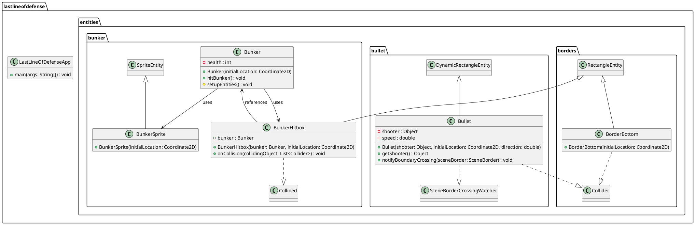

```plantuml
@startuml
package "lastlineofdefense" {

class LastLineOfDefenseApp {
+main(args: String[]) : void
}

package "entities.borders" {
class BorderBottom {
+BorderBottom(initialLocation: Coordinate2D)
}
BorderBottom -up-|> RectangleEntity
BorderBottom ..|> Collider
}

package "entities.bullet" {
class Bullet {
-shooter : Object
-speed : double
+Bullet(shooter: Object, initialLocation: Coordinate2D, direction: double)
+getShooter() : Object
+notifyBoundaryCrossing(sceneBorder: SceneBorder) : void
}
Bullet -up-|> DynamicRectangleEntity
Bullet ..|> SceneBorderCrossingWatcher
Bullet ..|> Collider
}

package "entities.bunker" {
class Bunker {
-health : int
+Bunker(initialLocation: Coordinate2D)
+hitBunker() : void
#setupEntities() : void
}

    class BunkerHitbox {
      -bunker : Bunker
      +BunkerHitbox(bunker: Bunker, initialLocation: Coordinate2D)
      +onCollision(collidingObject: List<Collider>) : void
    }

    class BunkerSprite {
      +BunkerSprite(initialLocation: Coordinate2D)
    }

    Bunker -down-> BunkerHitbox : uses
    Bunker -down-> BunkerSprite : uses
    BunkerHitbox --> Bunker : references
    BunkerHitbox ..|> Collided
    BunkerHitbox -up-|> RectangleEntity
    BunkerSprite -up-|> SpriteEntity
}
}
@enduml
```