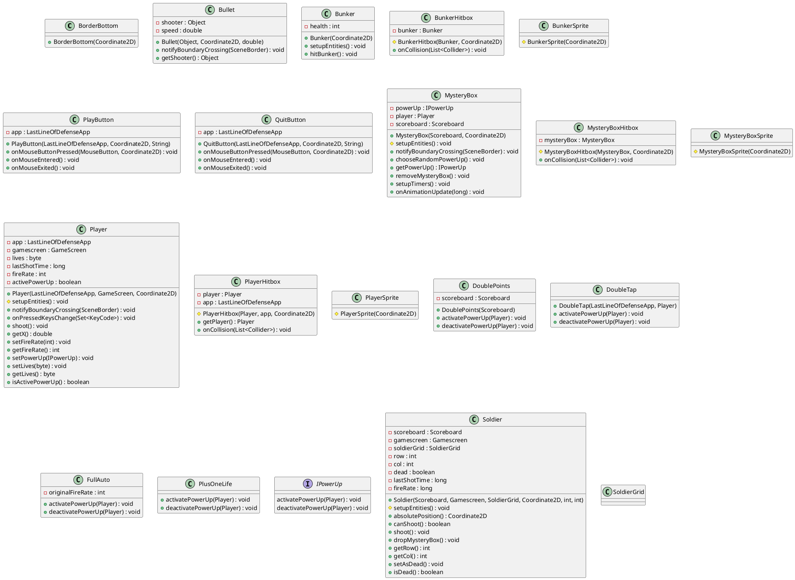

```plantuml
@startuml
class BorderBottom {
    + BorderBottom(Coordinate2D)
}
class Bullet {
    - shooter : Object
    - speed : double
    
    + Bullet(Object, Coordinate2D, double)
    + notifyBoundaryCrossing(SceneBorder) : void
    + getShooter() : Object
}
class Bunker {
    - health : int
    
    + Bunker(Coordinate2D)
    + setupEntities() : void
    + hitBunker() : void
}
class BunkerHitbox {
    - bunker : Bunker
    
    # BunkerHitbox(Bunker, Coordinate2D)
    + onCollision(List<Collider>) : void
}
class BunkerSprite {
    # BunkerSprite(Coordinate2D)
}
class PlayButton {
    - app : LastLineOfDefenseApp
    
    + PlayButton(LastLineOfDefenseApp, Coordinate2D, String)
    + onMouseButtonPressed(MouseButton, Coordinate2D) : void
    + onMouseEntered() : void
    + onMouseExited() : void
}
class QuitButton {
    - app : LastLineOfDefenseApp
    
    + QuitButton(LastLineOfDefenseApp, Coordinate2D, String)
    + onMouseButtonPressed(MouseButton, Coordinate2D) : void
    + onMouseEntered() : void
    + onMouseExited() : void
}
class MysteryBox {
    - powerUp : IPowerUp
    - player : Player
    - scoreboard : Scoreboard
    
    + MysteryBox(Scoreboard, Coordinate2D)
    # setupEntities() : void
    + notifyBoundaryCrossing(SceneBorder) : void
    + chooseRandomPowerUp() : void
    + getPowerUp() : IPowerUp
    + removeMysteryBox() : void
    + setupTimers() : void
    + onAnimationUpdate(long) : void
}
class MysteryBoxHitbox {
    - mysteryBox : MysteryBox
    
    # MysteryBoxHitbox(MysteryBox, Coordinate2D)
    + onCollision(List<Collider>) : void
}
class MysteryBoxSprite {
    # MysteryBoxSprite(Coordinate2D)
}
class Player {
    - app : LastLineOfDefenseApp
    - gamescreen : GameScreen
    - lives : byte
    - lastShotTime : long
    - fireRate : int
    - activePowerUp : boolean
    
    + Player(LastLineOfDefenseApp, GameScreen, Coordinate2D)
    # setupEntities() : void
    + notifyBoundaryCrossing(SceneBorder) : void
    + onPressedKeysChange(Set<KeyCode>) : void
    + shoot() : void
    + getX() : double
    + setFireRate(int) : void
    + getFireRate() : int
    + setPowerUp(IPowerUp) : void
    + setLives(byte) : void
    + getLives() : byte
    + isActivePowerUp() : boolean
}
class PlayerHitbox {
    - player : Player
    - app : LastLineOfDefenseApp
    
    # PlayerHitbox(Player, app, Coordinate2D)
    + getPlayer() : Player
    + onCollision(List<Collider>) : void
}
class PlayerSprite {
    # PlayerSprite(Coordinate2D)
}
class DoublePoints {
    - scoreboard : Scoreboard
    
    + DoublePoints(Scoreboard)
    + activatePowerUp(Player) : void
    + deactivatePowerUp(Player) : void
}
class DoubleTap {
    + DoubleTap(LastLineOfDefenseApp, Player)
    + activatePowerUp(Player) : void
    + deactivatePowerUp(Player) : void
}
class FullAuto {
    - originalFireRate : int
    + activatePowerUp(Player) : void
    + deactivatePowerUp(Player) : void
}
class PlusOneLife {
    + activatePowerUp(Player) : void
    + deactivatePowerUp(Player) : void
}
interface IPowerUp {
    activatePowerUp(Player) : void
    deactivatePowerUp(Player) : void
}
class Soldier {
    - scoreboard : Scoreboard
    - gamescreen : Gamescreen
    - soldierGrid : SoldierGrid
    - row : int
    - col : int
    - dead : boolean
    - lastShotTime : long
    - fireRate : long
    
    + Soldier(Scoreboard, Gamescreen, SoldierGrid, Coordinate2D, int, int)
    # setupEntities() : void
    + absolutePosition() : Coordinate2D
    + canShoot() : boolean
    + shoot() : void
    + dropMysteryBox() : void
    + getRow() : int
    + getCol() : int
    + setAsDead() : void
    + isDead() : boolean
}
class SoldierGrid {

}
@enduml
```