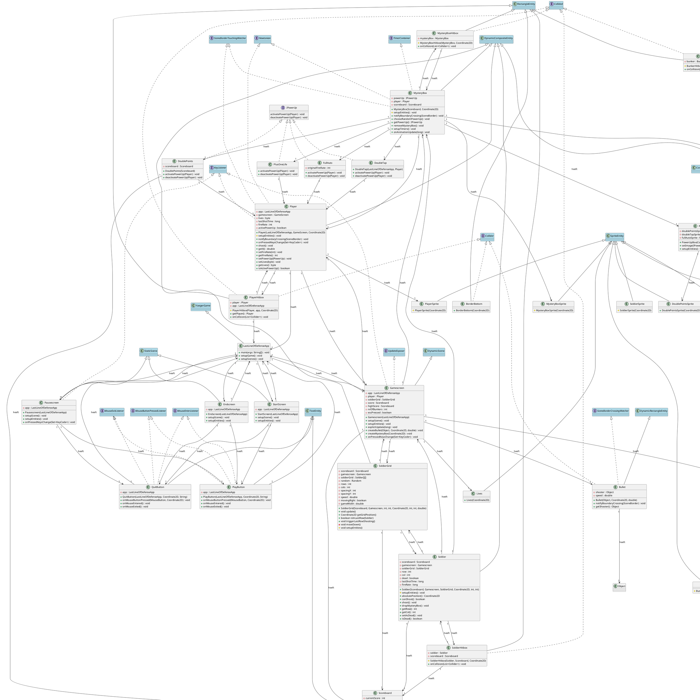

```plantuml
@startuml
class BorderBottom {
    + BorderBottom(Coordinate2D)
}
class Bullet {
    - shooter : Object
    - speed : double
    
    + Bullet(Object, Coordinate2D, double)
    + notifyBoundaryCrossing(SceneBorder) : void
    + getShooter() : Object
}
class Bunker {
    - health : int
    
    + Bunker(Coordinate2D)
    + setupEntities() : void
    + hitBunker() : void
}
class BunkerHitbox {
    - bunker : Bunker
    
    # BunkerHitbox(Bunker, Coordinate2D)
    + onCollision(List<Collider>) : void
}
class BunkerSprite {
    # BunkerSprite(Coordinate2D)
}
class PlayButton {
    - app : LastLineOfDefenseApp
    
    + PlayButton(LastLineOfDefenseApp, Coordinate2D, String)
    + onMouseButtonPressed(MouseButton, Coordinate2D) : void
    + onMouseEntered() : void
    + onMouseExited() : void
}
class QuitButton {
    - app : LastLineOfDefenseApp
    
    + QuitButton(LastLineOfDefenseApp, Coordinate2D, String)
    + onMouseButtonPressed(MouseButton, Coordinate2D) : void
    + onMouseEntered() : void
    + onMouseExited() : void
}
class MysteryBox {
    - powerUp : IPowerUp
    - player : Player
    - scoreboard : Scoreboard
    
    + MysteryBox(Scoreboard, Coordinate2D)
    # setupEntities() : void
    + notifyBoundaryCrossing(SceneBorder) : void
    + chooseRandomPowerUp() : void
    + getPowerUp() : IPowerUp
    + removeMysteryBox() : void
    + setupTimers() : void
    + onAnimationUpdate(long) : void
}
class MysteryBoxHitbox {
    - mysteryBox : MysteryBox
    
    # MysteryBoxHitbox(MysteryBox, Coordinate2D)
    + onCollision(List<Collider>) : void
}
class MysteryBoxSprite {
    # MysteryBoxSprite(Coordinate2D)
}
class Player {
    - app : LastLineOfDefenseApp
    - gamescreen : GameScreen
    - lives : byte
    - lastShotTime : long
    - fireRate : int
    - activePowerUp : boolean
    
    + Player(LastLineOfDefenseApp, GameScreen, Coordinate2D)
    # setupEntities() : void
    + notifyBoundaryCrossing(SceneBorder) : void
    + onPressedKeysChange(Set<KeyCode>) : void
    + shoot() : void
    + getX() : double
    + setFireRate(int) : void
    + getFireRate() : int
    + setPowerUp(IPowerUp) : void
    + setLives(byte) : void
    + getLives() : byte
    + isActivePowerUp() : boolean
}
class PlayerHitbox {
    - player : Player
    - app : LastLineOfDefenseApp
    
    # PlayerHitbox(Player, app, Coordinate2D)
    + getPlayer() : Player
    + onCollision(List<Collider>) : void
}
class PlayerSprite {
    # PlayerSprite(Coordinate2D)
}
class DoublePoints {
    - scoreboard : Scoreboard
    
    + DoublePoints(Scoreboard)
    + activatePowerUp(Player) : void
    + deactivatePowerUp(Player) : void
}
class DoubleTap {
    + DoubleTap(LastLineOfDefenseApp, Player)
    + activatePowerUp(Player) : void
    + deactivatePowerUp(Player) : void
}
class FullAuto {
    - originalFireRate : int
    + activatePowerUp(Player) : void
    + deactivatePowerUp(Player) : void
}
class PlusOneLife {
    + activatePowerUp(Player) : void
    + deactivatePowerUp(Player) : void
}
interface IPowerUp {
    activatePowerUp(Player) : void
    deactivatePowerUp(Player) : void
}
class Soldier {
    - scoreboard : Scoreboard
    - gamescreen : Gamescreen
    - soldierGrid : SoldierGrid
    - row : int
    - col : int
    - dead : boolean
    - lastShotTime : long
    - fireRate : long
    
    + Soldier(Scoreboard, Gamescreen, SoldierGrid, Coordinate2D, int, int)
    # setupEntities() : void
    + absolutePosition() : Coordinate2D
    + canShoot() : boolean
    + shoot() : void
    + dropMysteryBox() : void
    + getRow() : int
    + getCol() : int
    + setAsDead() : void
    + isDead() : boolean
}
class SoldierGrid {
    - scoreboard : Scoreboard
    - gamescreen : Gamescreen
    - soldierGrid : Soldier[][]
    - random : Random
    - rows : int
    - cols : int
    - spacingX : int
    - spacingY : int
    - speed : double
    - movingRight : boolean
    - gameWidth : double
    
    + SoldierGrid(Scoreboard, Gamescreen, int, int, Coordinate2D, int, int, double)
    + void update()
    + Coordinate2D getGridPosition()
    + boolean isInLastRow(Soldier)
    + void triggerLastRowShooting()
    - void moveDown()
    # void setupEntities()
}
class SoldierHitbox {
    - soldier : Soldier
    - scoreboard : Scoreboard
    
    # SoldierHitbox(Soldier, Scoreboard, Coordinate2D)
    + onCollision(List<Collider>) : void
}
class SoldierSprite {
    # SoldierSprite(Coordinate2D)
}
class Lives {
    + Lives(Coordinate2D)
}
class Scoreboard {
- currentScore : int
- highScore : int
- doublePoints : boolean

+ Scoreboard(Coordinate2D)
+ displayScore() : void
+ displayHighScore() : void
+ getCurrentScore() : int
+ setCurrentScore(int) : void
+ updateScore() : void
+ setDoublePoints(boolean) : void
}
class PowerUpBox {
- doublePointsSprite : DoublePointsSprite
- doubleTapSprite : DoubleTapSprite
- fullAutoSprite : FullAutoSprite

+ PowerUpBox(Coordinate2D)
+ setImage(IPowerUp) : void
+ setupEntities() : void
}
class DoublePointsSprite {
+ DoublePointsSprite(Coordinate2D)
}
class DoubleTapSprite {
+ DoubleTapSprite(Coordinate2D)
}
class FullAutoSprite {
+ FullAutoSprite(Coordinate2D)
}
class Endscreen {
- app : LastLineOfDefenseApp

+ Endscreen(LastLineOfDefenseApp)
+ setupScene() : void
+ setupEntities() : void
}
class Gamescreen {
- app : LastLineOfDefenseApp
- player : Player
- soldierGrid : SoldierGrid
- score : Scoreboard
- highScore : Scoreboard
- nrOfBunkers : int
- escPressed : boolean

+ Gamescreen(LastLineOfDefenseApp)
+ setupScene() : void
+ setupEntities() : void
+ explicitUpdate(long) : void
+ createBullet(Object, Coordinate2D, double) : void
+ createMysteryBox(Coordinate2D) : void
+ onPressedKeysChange(Set<KeyCode>) : void
}
class Pausescreen {
- app : LastLineOfDefenseApp

+ Pausescreen(LastLineOfDefenseApp)
+ setupScene() : void
+ setupEntities() : void
+ onPressedKeysChange(Set<KeyCode>) : void
}
class StartScreen {
- app : LastLineOfDefenseApp

+ StartScreen(LastLineOfDefenseApp)
+ setupScene() : void
+ setupEntities() : void
}
class LastLineOfDefenseApp {
+ main(args: String[]) : void
+ setupGame() : void
+ setupScenes() : void
}
class YaegerGame #lightblue{

}
class StaticScene #lightblue {

}
class DynamicScene #lightblue {

}
class TextEntity #lightblue {

}
class SpriteEntity #lightblue {

}
class RectangleEntity #lightblue {

}
class DynamicCompositeEntity #lightblue {

}
class DynamicRectangleEntity #lightblue {

}
class CompositeEntity #lightblue {

}
interface Collider #lightblue {

}
interface Collided #lightblue {

}
interface SceneBorderCrossingWatcher #lightblue {

}
interface MouseButtonPressedListener #lightblue {

}
interface MouseEnterListener #lightblue {

}
interface MouseExitListener #lightblue {

}
interface Newtonian #lightblue {

}
interface SceneBorderTouchingWatcher #lightblue {

}
interface TimerContainer #lightblue {

}
interface KeyListener #lightblue {

}
interface UpdateExposer #lightblue {

}

Collider <|... PlayerHitbox
Collider <|... Bullet
Collider <|... BorderBottom

Collided <|... BunkerHitbox
Collided <|... MysteryBoxHitbox
Collided <|... SoldierHitbox
Collided <|... PlayerHitbox

SceneBorderCrossingWatcher <|... Bullet

SceneBorderTouchingWatcher <|... Player
SceneBorderTouchingWatcher <|... MysteryBox

MouseButtonPressedListener <|... PlayButton
MouseButtonPressedListener <|... QuitButton
MouseEnterListener <|... PlayButton
MouseEnterListener <|... QuitButton
MouseExitListener <|... PlayButton
MouseExitListener <|... QuitButton

Newtonian <|... MysteryBox
Newtonian <|... Player

TimerContainer <|... MysteryBox

KeyListener <|... Player
KeyListener <|... Gamescreen
KeyListener <|... Pausescreen

UpdateExposer <|... Gamescreen

IPowerUp <|... DoublePoints
IPowerUp <|... DoubleTap
IPowerUp <|... FullAuto
IPowerUp <|... PlusOneLife

YaegerGame <|--- LastLineOfDefenseApp

DynamicScene <|--- Gamescreen

StaticScene <|--- StartScreen
StaticScene <|--- Pausescreen
StaticScene <|--- Endscreen

TextEntity <|--- Scoreboard
TextEntity <|--- PlayButton
TextEntity <|--- QuitButton

CompositeEntity <|--- PowerUpBox

SpriteEntity <|--- PlayerSprite
SpriteEntity <|--- BunkerSprite
SpriteEntity <|--- SoldierSprite
SpriteEntity <|--- MysteryBoxSprite
SpriteEntity <|--- DoublePointsSprite
SpriteEntity <|--- DoubleTapSprite
SpriteEntity <|--- FullAutoSprite
SpriteEntity <|--- Lives

RectangleEntity <|--- BorderBottom
RectangleEntity <|--- BunkerHitbox
RectangleEntity <|--- PlayerHitbox
RectangleEntity <|--- SoldierHitbox
RectangleEntity <|--- MysteryBoxHitbox

DynamicCompositeEntity <|--- SoldierGrid
DynamicCompositeEntity <|--- Soldier
DynamicCompositeEntity <|--- Bunker
DynamicCompositeEntity <|--- MysteryBox
DynamicCompositeEntity <|--- Player

DynamicRectangleEntity <|--- Bullet

LastLineOfDefenseApp "1" ---> "1" StartScreen : heeft
LastLineOfDefenseApp "1" ---> "1" Pausescreen : heeft
LastLineOfDefenseApp "1" ---> "1" Endscreen : heeft
LastLineOfDefenseApp "1" ---> "1" Gamescreen : heeft

StartScreen "1" ---> "1" PlayButton : heeft
StartScreen "1" ---> "1" QuitButton : heeft
StartScreen "1" ---> "1" LastLineOfDefenseApp : heeft

Pausescreen "1" ---> "1" LastLineOfDefenseApp : heeft
Pausescreen "1" ---> "1" PlayButton : heeft
Pausescreen "1" ---> "1" QuitButton : heeft

Gamescreen "1" ---> "1" LastLineOfDefenseApp : heeft
Gamescreen "1" ---> "1" Player : heeft
Gamescreen "1" ---> "1" SoldierGrid : heeft
Gamescreen "1" ---> "1.." Scoreboard : heeft
Gamescreen "1" ---> "1" Bunker : heeft
Gamescreen "1" ---> "1" Bullet : heeft
Gamescreen "1" ---> "1" MysteryBox : heeft
Gamescreen "1" ---> "1.." Lives : heeft

Endscreen "1" ---> "1" LastLineOfDefenseApp : heeft
Endscreen "1" ---> "1" PlayButton : heeft
Endscreen "1" ---> "1" QuitButton : heeft

PowerUpBox "1" ---> "1" DoublePointsSprite : heeft
PowerUpBox "1" ---> "1" DoubleTapSprite : heeft
PowerUpBox "1" ---> "1" FullAutoSprite : heeft

SoldierHitbox "1" ---> "1" Soldier : heeft
SoldierHitbox "1" ---> "1" Scoreboard : heeft

SoldierGrid "1" ---> "1.." Soldier : heeft
SoldierGrid "1" ---> "1" Scoreboard : heeft
SoldierGrid "1" ---> "1" Gamescreen : heeft

Soldier "1" ---> "1" SoldierHitbox : heeft
Soldier "1" ---> "1" SoldierGrid : heeft
Soldier "1" ---> "1" Scoreboard : heeft
Soldier "1" ---> "1" Gamescreen : heeft
Soldier "1" ---> "1" MysteryBox : heeft

PlusOneLife "1" ---> "1" Player : heeft
DoublePoints "1" ---> "1" Player : heeft
DoublePoints "1" ---> "1" Scoreboard : heeft
DoubleTap "1" ---> "1" Player : heeft
FullAuto "1" ---> "1" Player : heeft

PlayerHitbox "1" ---> "1" Player : heeft
PlayerHitbox "1" ---> "1" LastLineOfDefenseApp : heeft

Player "1" ---> "1" PlayerHitbox : heeft
Player "1" ---> "1" PlayerSprite : heeft
Player "1" ---> "1" LastLineOfDefenseApp : heeft
Player "1" ---> "1" Gamescreen : heeft

MysteryBoxHitbox "1" ---> "1" MysteryBox : heeft

MysteryBox "1" ---> "1" MysteryBoxHitbox : heeft
MysteryBox "1" ---> "1" Scoreboard : heeft
MysteryBox "1" ---> "1" Player : heeft
MysteryBox "1" ---> "1" MysteryBoxSprite : heeft
MysteryBox "1" ---> "1" PowerUpBox : heeft
MysteryBox "1" ---> "1" DoublePoints : heeft
MysteryBox "1" ---> "1" DoubleTap : heeft
MysteryBox "1" ---> "1" FullAuto : heeft
MysteryBox "1" ---> "1" PlusOneLife : heeft

QuitButton "1" ---> "1" LastLineOfDefenseApp : heeft
PlayButton "1" ---> "1" LastLineOfDefenseApp : heeft

BunkerHitbox "1" ---> "1" Bunker : heeft

Bunker "1" ---> "1" BunkerHitbox : heeft
Bunker "1" ---> "1" BunkerSprite : heeft

Bullet "1" ---> "1" Object : heeft
@enduml
```